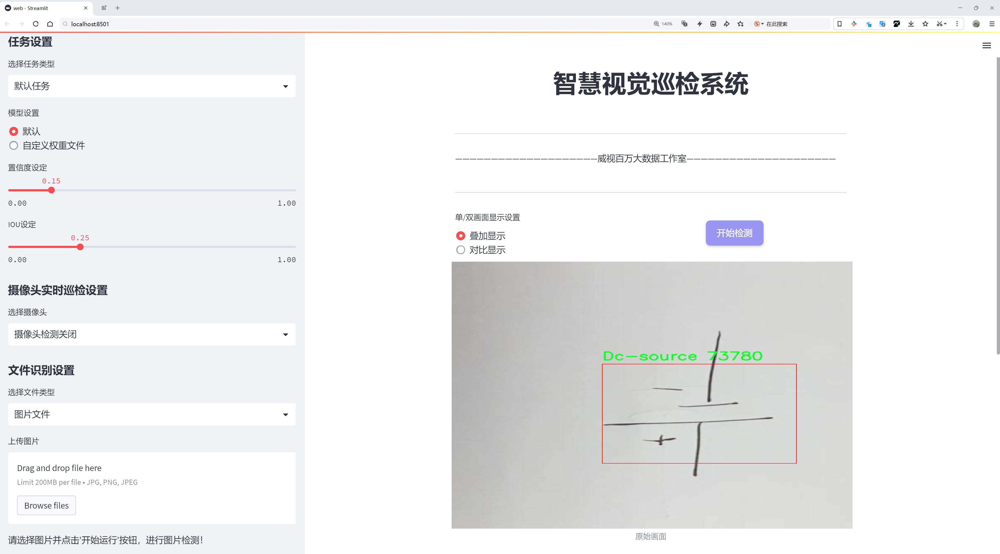
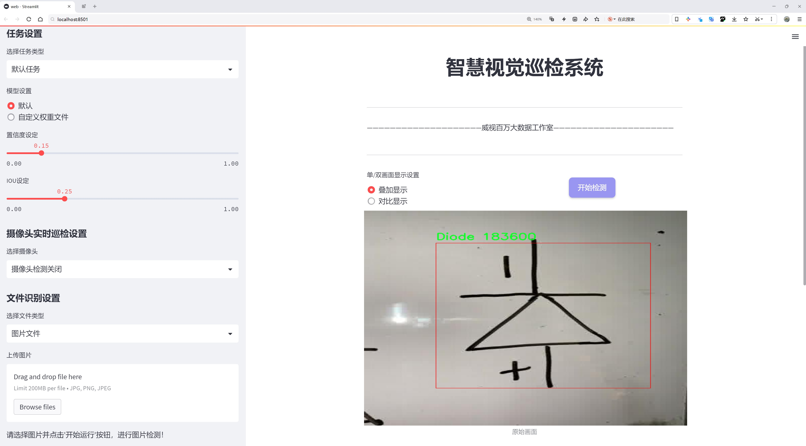
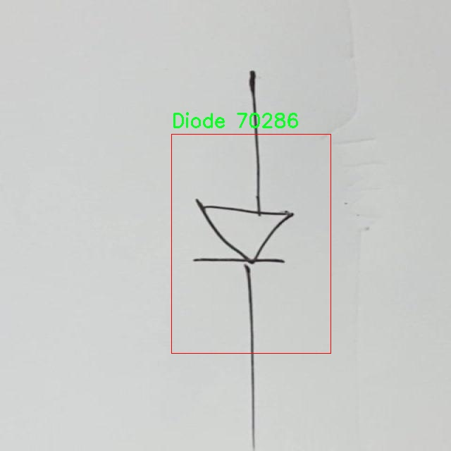
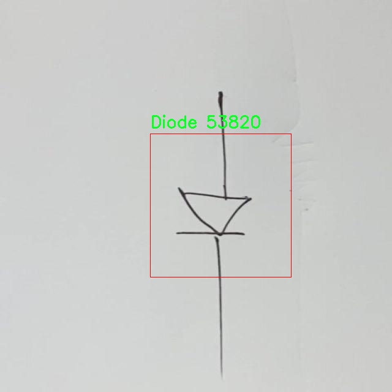
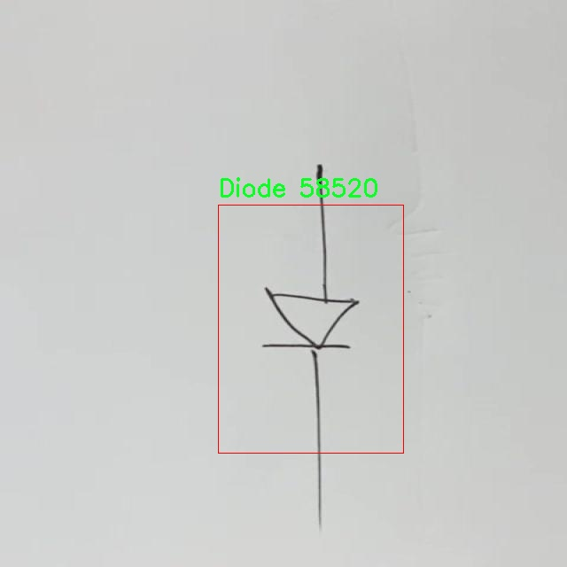
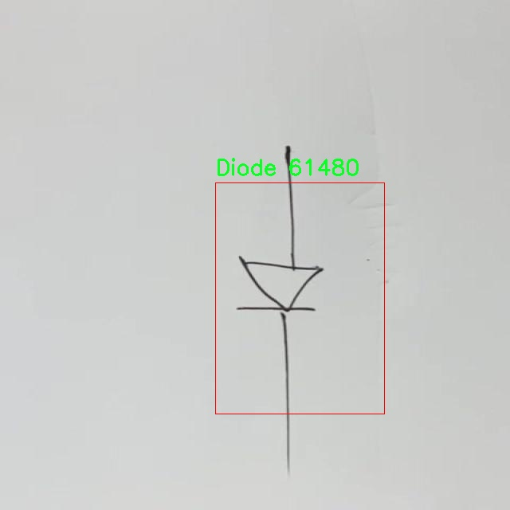
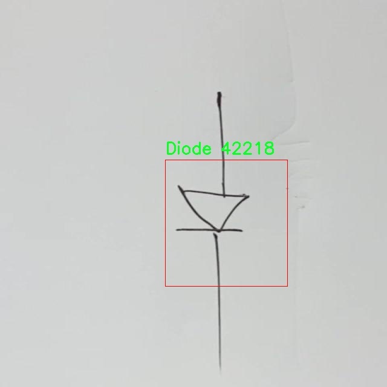

# 电子元件目标检测检测系统源码分享
 # [一条龙教学YOLOV8标注好的数据集一键训练_70+全套改进创新点发刊_Web前端展示]

### 1.研究背景与意义

项目参考[AAAI Association for the Advancement of Artificial Intelligence](https://gitee.com/qunmasj/projects)

研究背景与意义

随着电子技术的迅猛发展，电子元件的种类和数量日益增加，电子产品的复杂性也随之提升。在这一背景下，电子元件的自动检测与识别技术逐渐成为电子制造和维修领域的重要研究方向。传统的人工检测方法不仅效率低下，而且容易受到人为因素的影响，导致检测结果的不准确性。因此，开发一种高效、准确的电子元件目标检测系统显得尤为重要。

近年来，深度学习技术的飞速发展为目标检测领域带来了革命性的变化。其中，YOLO（You Only Look Once）系列模型因其优越的实时性和准确性而受到广泛关注。YOLOv8作为该系列的最新版本，进一步提升了检测精度和速度，成为实现电子元件自动检测的理想选择。然而，尽管YOLOv8在多个领域表现出色，但在特定的电子元件检测任务中，仍然存在一些挑战，例如小目标的检测精度、复杂背景下的干扰等。因此，基于改进YOLOv8的电子元件目标检测系统的研究具有重要的理论价值和实际意义。

本研究所使用的数据集包含4908张图像，涵盖了6类电子元件，包括交流源（Ac-source）、电容器（Capacitor）、直流源（Dc-source）、二极管（Diode）、电感器（Inductor）和电阻器（Resistor）。这些类别代表了电子元件的基本构成，涵盖了从电源到被动元件的多种类型，具有较强的代表性和广泛的应用场景。通过对这些电子元件进行高效的目标检测，不仅可以提高电子产品的生产效率，还能在维修和故障诊断中提供有效的支持。

本研究的意义在于，通过改进YOLOv8模型，针对电子元件的特性进行优化，提升其在复杂环境下的检测能力。这一过程将涉及数据预处理、模型结构调整、损失函数优化等多个方面，旨在实现更高的检测精度和更快的响应速度。此外，研究成果不仅可以为电子元件的自动检测提供技术支持，还可以为相关领域的研究提供参考，推动智能制造和工业自动化的发展。

总之，基于改进YOLOv8的电子元件目标检测系统的研究，不仅具有重要的学术价值，也为实际应用提供了切实可行的解决方案。随着电子元件检测技术的不断进步，预计将为电子产业的智能化转型和升级提供强有力的支持，推动整个行业向更高效、更智能的方向发展。

### 2.图片演示






##### 注意：由于此博客编辑较早，上面“2.图片演示”和“3.视频演示”展示的系统图片或者视频可能为老版本，新版本在老版本的基础上升级如下：（实际效果以升级的新版本为准）

  （1）适配了YOLOV8的“目标检测”模型和“实例分割”模型，通过加载相应的权重（.pt）文件即可自适应加载模型。

  （2）支持“图片识别”、“视频识别”、“摄像头实时识别”三种识别模式。

  （3）支持“图片识别”、“视频识别”、“摄像头实时识别”三种识别结果保存导出，解决手动导出（容易卡顿出现爆内存）存在的问题，识别完自动保存结果并导出到。

  （4）支持Web前端系统中的标题、背景图等自定义修改，后面提供修改教程。

  另外本项目提供训练的数据集和训练教程,暂不提供权重文件（best.pt）,需要您按照教程进行训练后实现图片演示和Web前端界面演示的效果。

### 3.视频演示

[3.1 视频演示](https://www.bilibili.com/video/BV1q4W2e5EeU/?vd_source=ff015de2d29cbe2a9cdbfa7064407a08)

### 4.数据集信息展示

数据集信息展示

本数据集名为“FYP”，专为改进YOLOv8的电子元件目标检测系统而设计，旨在为研究人员和开发者提供一个高质量的训练基础。该数据集包含4908张图像，涵盖了六个主要类别的电子元件，分别是交流电源（Ac-source）、电容器（Capacitor）、直流电源（Dc-source）、二极管（Diode）、电感器（Inductor）和电阻器（Resistor）。这些类别的选择不仅反映了电子元件的多样性，也为目标检测算法的训练提供了丰富的样本。

在数据集的构建过程中，特别注重图像的多样性和代表性，以确保模型在实际应用中的泛化能力。图像的拍摄环境、角度和光照条件各不相同，涵盖了电子元件在不同场景下的表现。这种多样性使得模型能够更好地适应各种实际应用场景，从而提高目标检测的准确性和鲁棒性。

每个类别的样本数量经过精心设计，以确保模型在训练过程中能够获得均衡的学习机会。具体而言，交流电源和直流电源作为电源类元件，具有相似的功能但在形态上存在差异，能够帮助模型学习到不同电源的特征。而电容器、电感器和电阻器则是电路中不可或缺的被动元件，各自具有独特的电气特性，通过对这些元件的学习，模型能够掌握更多的电路分析知识。二极管作为一种重要的半导体器件，其特征在于单向导电性，模型通过识别二极管的形态和特征，可以有效提升对电路中信号流向的理解。

数据集的图像均以高分辨率提供，确保了细节的清晰度，这对于目标检测任务至关重要。高质量的图像能够帮助模型更准确地识别和定位目标，减少误检和漏检的情况。此外，数据集还遵循了CC BY 4.0的许可证，这意味着用户可以自由使用、修改和分发数据集，只需给予适当的署名。这一开放的许可证促进了学术界和工业界的合作，鼓励更多的研究者和开发者在此基础上进行创新和改进。

为了便于用户访问和使用，数据集提供了便捷的下载链接，用户可以轻松获取所需的图像数据。这一举措不仅提高了数据集的可用性，也为目标检测系统的开发提供了强有力的支持。随着电子元件在现代科技中的广泛应用，开发一个高效的目标检测系统将对电子产品的设计、制造和维护产生深远的影响。

总之，FYP数据集以其丰富的样本、清晰的图像和合理的类别划分，为改进YOLOv8的电子元件目标检测系统提供了坚实的基础。通过充分利用这一数据集，研究人员和开发者能够加速算法的训练和优化，推动电子元件检测技术的进步，最终实现更高效的电子产品开发和应用。











### 5.全套项目环境部署视频教程（零基础手把手教学）

[5.1 环境部署教程链接（零基础手把手教学）](https://www.ixigua.com/7404473917358506534?logTag=c807d0cbc21c0ef59de5)


[5.2 安装Python虚拟环境创建和依赖库安装视频教程链接（零基础手把手教学）](https://www.ixigua.com/7404474678003106304?logTag=1f1041108cd1f708b01a)

### 6.手把手YOLOV8训练视频教程（零基础小白有手就能学会）

[6.1 环境部署教程链接（零基础手把手教学）](https://www.ixigua.com/7404477157818401292?logTag=d31a2dfd1983c9668658)

### 7.70+种全套YOLOV8创新点代码加载调参视频教程（一键加载写好的改进模型的配置文件）

[7.1 环境部署教程链接（零基础手把手教学）](https://www.ixigua.com/7404478314661806627?logTag=29066f8288e3f4eea3a4)

### 8.70+种全套YOLOV8创新点原理讲解（非科班也可以轻松写刊发刊，V10版本正在科研待更新）

由于篇幅限制，每个创新点的具体原理讲解就不一一展开，具体见下列网址中的创新点对应子项目的技术原理博客网址【Blog】：


[8.1 70+种全套YOLOV8创新点原理讲解链接](https://gitee.com/qunmasj/good)

### 9.系统功能展示（检测对象为举例，实际内容以本项目数据集为准）

图1.系统支持检测结果表格显示

  图2.系统支持置信度和IOU阈值手动调节

  图3.系统支持自定义加载权重文件best.pt(需要你通过步骤5中训练获得)

  图4.系统支持摄像头实时识别

  图5.系统支持图片识别

  图6.系统支持视频识别

  图7.系统支持识别结果文件自动保存

  图8.系统支持Excel导出检测结果数据


### 10.原始YOLOV8算法原理

原始YOLOv8算法原理

YOLO（You Only Look Once）系列算法自其诞生以来，便以其高效的目标检测能力而广受关注。随着技术的不断进步，YOLO算法经历了多个版本的迭代，其中YOLOv8作为最新的版本，展现出了在检测精度和速度上的显著优势。YOLOv8的设计理念依然遵循单阶段检测的原则，但在网络结构和算法优化上进行了多项创新，旨在提升模型的整体性能。

YOLOv8的网络结构主要由四个核心部分组成：输入模块、Backbone骨干网络、Neck特征融合网络和Head检测模块。输入模块的设计尤为重要，它负责对输入图像进行预处理，以适应后续的特征提取和目标检测。YOLOv8默认的输入图像尺寸为640x640，但在实际应用中，图像的长宽比往往各不相同。为了解决这一问题，YOLOv8采用了自适应图像缩放的方法。该方法的核心思想是将图像的长边按比例缩小至指定尺寸，然后对短边进行填充，从而最大限度地减少信息冗余，提高目标检测的效率。此外，YOLOv8在训练过程中引入了Mosaic增强技术，通过将四张不同的图像随机缩放并拼接成一张新图像，促使模型学习到更丰富的特征和上下文信息，这一策略有效提升了模型的预测精度。

在Backbone部分，YOLOv8对主干网络进行了重要的改进。相较于YOLOv5中使用的C3模块，YOLOv8引入了C2f模块，这一变化不仅提升了特征提取的效率，还增强了模型的轻量化特性。C2f模块通过并行化多个梯度流分支，能够在保持模型轻量化的同时，获得更丰富的梯度信息。这种设计使得YOLOv8在特征提取的过程中，能够更好地捕捉到图像中的细节和复杂的特征，从而为后续的目标检测奠定了坚实的基础。

YOLOv8的Neck部分采用了双塔结构，通过特征金字塔和路径聚合网络的结合，进一步增强了语义和定位特征的融合能力。这一设计不仅促进了不同尺度特征的有效转移，还提升了模型对多尺度目标的检测性能。通过这种特征融合策略，YOLOv8能够在复杂场景中更准确地识别和定位目标，展现出卓越的检测能力。

在Head检测模块中，YOLOv8进行了结构上的重大调整，采用了解耦头（Decoupled Head）结构。这一结构将目标检测和分类任务分开处理，分别通过两个独立的卷积模块进行特征的降维和预测。这种解耦设计不仅提高了模型的收敛速度，还有效减少了不同任务之间的干扰，从而提升了整体的检测精度。此外，YOLOv8在损失函数的设计上也进行了创新，取消了传统的对象分支，改为在分类分支中使用二值交叉熵损失（BCELoss），而在边界框回归分支中则采用了分布焦点损失（DFL）和CIoU损失。这一改进旨在使模型能够更快地聚焦于目标标签附近的区域，从而提高检测的准确性。

值得一提的是，YOLOv8摒弃了以往的Anchor-Based（基于锚框）检测方法，转而采用Anchor-Free（无锚框）的方法。这一转变使得YOLOv8在目标检测中不再依赖于预设的锚框，而是将目标检测问题转化为关键点检测。这种方法不仅简化了网络结构，还增强了模型的泛化能力，避免了因锚框设置不当而导致的检测性能下降。通过这一创新，YOLOv8能够更灵活地适应不同数据集的特征，提升了在多样化场景下的检测效果。

总的来说，YOLOv8在多个方面进行了优化和创新，使其在目标检测任务中表现出色。通过自适应图像缩放、Mosaic增强、C2f模块、双塔结构的特征融合、解耦头结构以及Anchor-Free检测方法等一系列改进，YOLOv8不仅提高了检测精度和速度，还增强了模型的灵活性和适应性。这些特性使得YOLOv8成为目标检测、图像分割和图像分类等任务的理想选择，进一步推动了计算机视觉领域的发展。随着YOLOv8的广泛应用，其在实际场景中的表现将为更多研究提供宝贵的经验和启示。


### 11.项目核心源码讲解（再也不用担心看不懂代码逻辑）

#### 11.1 ui.py

以下是经过简化和注释的核心代码部分：

```python
import sys
import subprocess
from QtFusion.path import abs_path

def run_script(script_path):
    """
    使用当前 Python 环境运行指定的脚本。

    Args:
        script_path (str): 要运行的脚本路径
    """
    # 获取当前 Python 解释器的路径
    python_path = sys.executable

    # 构建运行命令，使用 streamlit 运行指定的脚本
    command = f'"{python_path}" -m streamlit run "{script_path}"'

    # 执行命令并等待其完成
    result = subprocess.run(command, shell=True)
    
    # 检查命令执行的返回码，如果不为0则表示出错
    if result.returncode != 0:
        print("脚本运行出错。")

# 主程序入口
if __name__ == "__main__":
    # 获取要运行的脚本的绝对路径
    script_path = abs_path("web.py")

    # 调用函数运行脚本
    run_script(script_path)
```

### 代码说明：
1. **导入模块**：
   - `sys`：用于获取当前 Python 解释器的路径。
   - `subprocess`：用于执行外部命令。
   - `abs_path`：从 `QtFusion.path` 模块导入的函数，用于获取文件的绝对路径。

2. **`run_script` 函数**：
   - 该函数接收一个脚本路径作为参数，并使用当前 Python 环境运行该脚本。
   - 首先，通过 `sys.executable` 获取当前 Python 解释器的路径。
   - 然后，构建一个命令字符串，使用 `streamlit` 模块运行指定的脚本。
   - 使用 `subprocess.run` 执行命令，并等待其完成。
   - 如果返回码不为0，表示脚本运行出错，打印错误信息。

3. **主程序入口**：
   - 在 `if __name__ == "__main__":` 块中，获取要运行的脚本的绝对路径（这里是 `web.py`）。
   - 最后，调用 `run_script` 函数来执行该脚本。

这个文件名为 `ui.py`，它的主要功能是运行一个指定的 Python 脚本，具体来说是通过 Streamlit 框架来启动一个 Web 应用。文件中导入了几个模块，包括 `sys`、`os` 和 `subprocess`，这些模块提供了与系统交互的功能。

首先，文件定义了一个名为 `run_script` 的函数，该函数接受一个参数 `script_path`，表示要运行的脚本的路径。在函数内部，首先通过 `sys.executable` 获取当前 Python 解释器的路径，这样可以确保使用的是当前环境中的 Python 版本。接着，构建了一个命令字符串，该命令用于调用 Streamlit 来运行指定的脚本。

使用 `subprocess.run` 方法来执行构建好的命令。这个方法会在一个新的进程中运行命令，并等待其完成。如果命令执行的返回码不为 0，表示脚本运行过程中出现了错误，此时会打印出一条错误信息。

在文件的最后部分，使用了一个常见的 Python 结构 `if __name__ == "__main__":`，这段代码确保只有在直接运行该脚本时，以下代码才会被执行。在这里，首先调用 `abs_path` 函数来获取 `web.py` 脚本的绝对路径，然后调用 `run_script` 函数来运行这个脚本。

总体来说，这个 `ui.py` 文件的作用是作为一个启动器，方便用户通过 Streamlit 框架运行一个名为 `web.py` 的 Web 应用脚本。

#### 11.2 ultralytics\models\sam\predict.py

以下是经过简化和注释的核心代码部分，主要集中在`Predictor`类及其关键方法上：

```python
import numpy as np
import torch
import torch.nn.functional as F
import torchvision

class Predictor:
    """
    Segment Anything Model (SAM) 的预测器类，负责图像分割任务的推理。
    """

    def __init__(self, cfg, overrides=None):
        """
        初始化预测器，设置模型配置和覆盖参数。
        """
        if overrides is None:
            overrides = {}
        # 更新配置，设置任务为分割，模式为预测
        overrides.update(dict(task="segment", mode="predict", imgsz=1024))
        self.args = overrides
        self.im = None  # 输入图像
        self.features = None  # 提取的图像特征
        self.prompts = {}  # 存储提示信息
        self.segment_all = False  # 是否分割所有对象的标志

    def preprocess(self, im):
        """
        预处理输入图像，为模型推理做准备。
        """
        if self.im is not None:
            return self.im
        # 将输入图像转换为张量格式
        im = np.stack(self.pre_transform(im))
        im = im[..., ::-1].transpose((0, 3, 1, 2))  # BGR转RGB并调整维度
        im = torch.from_numpy(im).to(self.device)  # 转换为张量并移动到设备
        im = im.half() if self.model.fp16 else im.float()  # 根据模型设置选择数据类型
        return im

    def inference(self, im, bboxes=None, points=None, masks=None):
        """
        根据输入提示进行图像分割推理。
        """
        # 如果没有提供提示，调用生成方法
        if all(i is None for i in [bboxes, points, masks]):
            return self.generate(im)

        return self.prompt_inference(im, bboxes, points, masks)

    def prompt_inference(self, im, bboxes=None, points=None, masks=None):
        """
        基于提示信息进行图像分割推理。
        """
        features = self.model.image_encoder(im)  # 提取图像特征
        # 处理提示信息（边界框、点、掩码）
        # 生成掩码和分数
        pred_masks, pred_scores = self.model.mask_decoder(
            image_embeddings=features,
            sparse_prompt_embeddings=self.model.prompt_encoder(points=points, boxes=bboxes, masks=masks)
        )
        return pred_masks, pred_scores  # 返回预测的掩码和分数

    def generate(self, im):
        """
        对整个图像进行分割，生成掩码和边界框。
        """
        self.segment_all = True  # 设置为分割所有对象
        # 生成掩码和边界框的逻辑
        # 这里省略具体实现
        return pred_masks, pred_scores, pred_bboxes  # 返回生成的掩码、分数和边界框

    def setup_model(self, model):
        """
        初始化Segment Anything Model (SAM)。
        """
        self.model = model.eval().to(self.device)  # 将模型设置为评估模式并移动到设备
        # 设置图像归一化参数
        self.mean = torch.tensor([123.675, 116.28, 103.53]).view(-1, 1, 1).to(self.device)
        self.std = torch.tensor([58.395, 57.12, 57.375]).view(-1, 1, 1).to(self.device)

    def postprocess(self, preds, img, orig_imgs):
        """
        后处理推理结果，生成检测掩码和边界框。
        """
        pred_masks, pred_scores = preds  # 提取预测的掩码和分数
        # 对掩码和边界框进行缩放和阈值处理
        # 这里省略具体实现
        return results  # 返回结果列表
```

### 代码注释说明：
1. **类和方法概述**：注释中对`Predictor`类及其主要方法进行了简要描述，说明其功能和作用。
2. **参数和返回值**：每个方法的参数和返回值都有详细说明，帮助理解输入输出的格式和意义。
3. **核心逻辑**：简化了部分逻辑，去掉了与具体实现无关的细节，保留了核心的推理和处理流程。

以上代码提供了对`Predictor`类的基本理解和使用方式，适合对图像分割任务感兴趣的开发者进行学习和参考。

这个程序文件 `ultralytics\models\sam\predict.py` 是 Ultralytics YOLO 框架的一部分，主要用于实现 Segment Anything Model (SAM) 的预测逻辑。SAM 是一种先进的图像分割模型，具备可提示的分割和零样本性能，适用于高性能、实时的图像分割任务。

文件中首先导入了一些必要的库，包括 NumPy、PyTorch 和 torchvision。接着，它定义了一个 `Predictor` 类，该类继承自 `BasePredictor`，为图像分割任务提供了模型推理的接口。该类的构造函数初始化了一些属性，包括配置字典、覆盖的配置、回调函数等，并设置了一些特定于任务的参数。

`preprocess` 方法用于对输入图像进行预处理，包括图像的变换和归一化。它支持输入为 PyTorch 张量或 NumPy 数组的列表，并将其转换为适合模型输入的格式。`pre_transform` 方法则执行初步的图像变换，如调整大小。

`inference` 方法是进行图像分割推理的核心，接受多种提示（如边界框、点、掩码等），并利用 SAM 的架构进行实时分割。如果没有提供提示，则调用 `generate` 方法进行全图分割。

`generate` 方法通过 SAM 的高级架构对整个图像进行分割，可以选择在图像的裁剪区域上进行更精细的分割。它支持多层裁剪和非最大抑制（NMS）来去除重复的掩码。

`setup_model` 方法用于初始化 SAM 模型，配置设备和图像归一化参数。`postprocess` 方法对模型的输出进行后处理，将掩码和边界框缩放到原始图像大小，并应用阈值来过滤掩码预测。

此外，`setup_source` 方法配置推理的数据源，`set_image` 方法用于设置单张图像进行推理，`set_prompts` 方法用于提前设置提示。`remove_small_regions` 方法则用于后处理生成的分割掩码，去除小的、断开的区域，并执行 NMS。

总体而言，这个文件实现了 SAM 模型的推理流程，提供了图像分割所需的各种功能和工具，能够灵活地处理不同类型的输入和提示，以满足实时分割的需求。

#### 11.3 ultralytics\utils\callbacks\mlflow.py

以下是代码中最核心的部分，并附上详细的中文注释：

```python
from ultralytics.utils import LOGGER, RUNS_DIR, SETTINGS, TESTS_RUNNING, colorstr

try:
    import os

    # 确保在非测试环境下运行，且mlflow集成已启用
    assert not TESTS_RUNNING or "test_mlflow" in os.environ.get("PYTEST_CURRENT_TEST", "")
    assert SETTINGS["mlflow"] is True  # 验证mlflow集成是否启用
    import mlflow

    assert hasattr(mlflow, "__version__")  # 验证mlflow包是否正确导入
    from pathlib import Path

    PREFIX = colorstr("MLflow: ")  # 设置日志前缀
    # 定义一个函数用于清理日志参数
    SANITIZE = lambda x: {k.replace("(", "").replace(")", ""): float(v) for k, v in x.items()}

except (ImportError, AssertionError):
    mlflow = None  # 如果导入失败，则将mlflow设置为None


def on_pretrain_routine_end(trainer):
    """
    在预训练结束时记录训练参数到MLflow。

    此函数根据环境变量和训练器参数设置MLflow日志。它设置跟踪URI、实验名称和运行名称，
    然后启动MLflow运行（如果尚未激活）。最后记录训练器的参数。

    参数:
        trainer (ultralytics.engine.trainer.BaseTrainer): 包含要记录的参数和参数的训练对象。

    全局变量:
        mlflow: 用于记录的mlflow模块。

    环境变量:
        MLFLOW_TRACKING_URI: MLflow跟踪的URI。如果未设置，默认为'runs/mlflow'。
        MLFLOW_EXPERIMENT_NAME: MLflow实验的名称。如果未设置，默认为trainer.args.project。
        MLFLOW_RUN: MLflow运行的名称。如果未设置，默认为trainer.args.name。
    """
    global mlflow

    # 获取跟踪URI，默认为RUNS_DIR下的'mlflow'
    uri = os.environ.get("MLFLOW_TRACKING_URI") or str(RUNS_DIR / "mlflow")
    LOGGER.debug(f"{PREFIX} tracking uri: {uri}")
    mlflow.set_tracking_uri(uri)  # 设置MLflow跟踪URI

    # 设置实验和运行名称
    experiment_name = os.environ.get("MLFLOW_EXPERIMENT_NAME") or trainer.args.project or "/Shared/YOLOv8"
    run_name = os.environ.get("MLFLOW_RUN") or trainer.args.name
    mlflow.set_experiment(experiment_name)  # 设置实验名称

    mlflow.autolog()  # 启用自动记录
    try:
        # 启动MLflow运行
        active_run = mlflow.active_run() or mlflow.start_run(run_name=run_name)
        LOGGER.info(f"{PREFIX}logging run_id({active_run.info.run_id}) to {uri}")
        if Path(uri).is_dir():
            LOGGER.info(f"{PREFIX}view at http://127.0.0.1:5000 with 'mlflow server --backend-store-uri {uri}'")
        LOGGER.info(f"{PREFIX}disable with 'yolo settings mlflow=False'")
        mlflow.log_params(dict(trainer.args))  # 记录训练参数
    except Exception as e:
        LOGGER.warning(f"{PREFIX}WARNING ⚠️ Failed to initialize: {e}\n" f"{PREFIX}WARNING ⚠️ Not tracking this run")


def on_train_end(trainer):
    """在训练结束时记录模型工件到MLflow。"""
    if mlflow:
        # 记录最佳模型的路径
        mlflow.log_artifact(str(trainer.best.parent))  
        # 记录保存目录中的所有文件
        for f in trainer.save_dir.glob("*"):  
            if f.suffix in {".png", ".jpg", ".csv", ".pt", ".yaml"}:
                mlflow.log_artifact(str(f))

        mlflow.end_run()  # 结束当前的MLflow运行
        LOGGER.info(
            f"{PREFIX}results logged to {mlflow.get_tracking_uri()}\n"
            f"{PREFIX}disable with 'yolo settings mlflow=False'"
        )


# 定义回调函数
callbacks = (
    {
        "on_pretrain_routine_end": on_pretrain_routine_end,
        "on_train_end": on_train_end,
    }
    if mlflow
    else {}
)
```

### 代码核心部分说明：
1. **导入必要的模块**：首先导入了所需的模块和工具，包括日志记录、路径处理和MLflow。
2. **环境检查**：确保在非测试环境下运行，并验证MLflow集成是否启用。
3. **`on_pretrain_routine_end`函数**：在预训练结束时记录训练参数到MLflow，包括设置跟踪URI、实验名称和运行名称。
4. **`on_train_end`函数**：在训练结束时记录模型的工件（如最佳模型和其他文件）到MLflow，并结束当前的MLflow运行。
5. **回调函数定义**：根据是否成功导入MLflow，定义需要的回调函数。

这个程序文件是Ultralytics YOLO项目中的一个模块，主要用于集成MLflow进行训练过程的日志记录。MLflow是一个开源平台，旨在管理机器学习生命周期，包括实验跟踪、模型管理和部署等功能。

文件开头的文档字符串简要介绍了该模块的功能，说明它可以记录训练过程中的指标、参数和模型工件。用户需要设置跟踪URI，并可以通过环境变量自定义日志记录的行为。文档中还提供了一些命令，帮助用户设置项目名称、运行名称，启动本地MLflow服务器，以及终止所有正在运行的MLflow服务器实例。

接下来的代码部分首先导入了一些必要的模块和库，包括Ultralytics的日志记录器、运行目录、设置和测试状态等。然后尝试导入os模块，并进行一些断言检查，以确保在测试运行时不记录日志，并且MLflow集成已启用。如果导入或断言失败，则将mlflow设置为None。

接下来的几个函数分别用于在不同的训练阶段记录日志。`on_pretrain_routine_end`函数在预训练结束时被调用，负责设置MLflow的跟踪URI、实验名称和运行名称，并开始一个新的MLflow运行。它还会记录训练器的参数。如果在初始化过程中出现异常，则会发出警告。

`on_train_epoch_end`和`on_fit_epoch_end`函数分别在每个训练和拟合的周期结束时被调用，记录训练指标。它们使用一个名为SANITIZE的lambda函数来清理和格式化要记录的指标数据。

`on_train_end`函数在训练结束时被调用，负责记录模型工件，包括最佳模型权重和其他文件（如图像、CSV、YAML等）。最后，它会结束当前的MLflow运行，并输出结果记录的URI。

最后，代码定义了一个回调字典，包含了在特定训练阶段调用的函数，如果mlflow未导入，则该字典为空。整体而言，这个模块为Ultralytics YOLO提供了一个灵活的日志记录机制，方便用户跟踪和管理训练过程中的各种信息。

#### 11.4 ultralytics\utils\checks.py

以下是代码中最核心的部分，并附上详细的中文注释：

```python
def parse_requirements(file_path=ROOT.parent / "requirements.txt", package=""):
    """
    解析 requirements.txt 文件，忽略以 '#' 开头的行和 '#' 后的任何文本。

    参数:
        file_path (Path): requirements.txt 文件的路径。
        package (str, optional): 使用的 Python 包名，默认为空。

    返回:
        (List[Dict[str, str]]): 解析后的需求列表，每个需求以字典形式表示，包含 `name` 和 `specifier` 键。
    """
    if package:
        # 如果指定了包名，则从该包的元数据中获取依赖
        requires = [x for x in metadata.distribution(package).requires if "extra == " not in x]
    else:
        # 否则，从指定的文件路径读取依赖
        requires = Path(file_path).read_text().splitlines()

    requirements = []
    for line in requires:
        line = line.strip()
        if line and not line.startswith("#"):
            line = line.split("#")[0].strip()  # 忽略行内注释
            match = re.match(r"([a-zA-Z0-9-_]+)\s*([<>!=~]+.*)?", line)
            if match:
                # 将解析出的依赖添加到列表中
                requirements.append(SimpleNamespace(name=match[1], specifier=match[2].strip() if match[2] else ""))

    return requirements


def check_version(
    current: str = "0.0.0",
    required: str = "0.0.0",
    name: str = "version",
    hard: bool = False,
    verbose: bool = False,
    msg: str = "",
) -> bool:
    """
    检查当前版本是否满足所需版本或范围。

    参数:
        current (str): 当前版本或包名。
        required (str): 所需版本或范围（以 pip 风格格式）。
        name (str, optional): 用于警告消息的名称。
        hard (bool, optional): 如果为 True，当要求不满足时引发 AssertionError。
        verbose (bool, optional): 如果为 True，当要求不满足时打印警告消息。
        msg (str, optional): 如果 verbose，显示的额外消息。

    返回:
        (bool): 如果满足要求则返回 True，否则返回 False。
    """
    if not current:  # 如果 current 是空字符串或 None
        LOGGER.warning(f"WARNING ⚠️ invalid check_version({current}, {required}) requested, please check values.")
        return True
    elif not current[0].isdigit():  # current 是包名而不是版本字符串
        try:
            name = current  # 将包名赋值给 'name' 参数
            current = metadata.version(current)  # 从包名获取版本字符串
        except metadata.PackageNotFoundError as e:
            if hard:
                raise ModuleNotFoundError(emojis(f"WARNING ⚠️ {current} package is required but not installed")) from e
            else:
                return False

    if not required:  # 如果 required 是空字符串或 None
        return True

    op = ""
    version = ""
    result = True
    c = parse_version(current)  # 将当前版本解析为元组
    for r in required.strip(",").split(","):
        op, version = re.match(r"([^0-9]*)([\d.]+)", r).groups()  # 分离操作符和版本号
        v = parse_version(version)  # 将所需版本解析为元组
        # 根据操作符检查版本
        if op == "==" and c != v:
            result = False
        elif op == "!=" and c == v:
            result = False
        elif op in (">=", "") and not (c >= v):  # 如果没有约束，假设为 '>=required'
            result = False
        elif op == "<=" and not (c <= v):
            result = False
        elif op == ">" and not (c > v):
            result = False
        elif op == "<" and not (c < v):
            result = False
    if not result:
        warning = f"WARNING ⚠️ {name}{op}{version} is required, but {name}=={current} is currently installed {msg}"
        if hard:
            raise ModuleNotFoundError(emojis(warning))  # 确保版本要求满足
        if verbose:
            LOGGER.warning(warning)
    return result


def check_requirements(requirements=ROOT.parent / "requirements.txt", exclude=(), install=True, cmds=""):
    """
    检查已安装的依赖项是否满足 YOLOv8 的要求，并在需要时尝试自动更新。

    参数:
        requirements (Union[Path, str, List[str]]): requirements.txt 文件的路径，单个包要求字符串，或包要求字符串列表。
        exclude (Tuple[str]): 要排除检查的包名元组。
        install (bool): 如果为 True，尝试自动更新不满足要求的包。
        cmds (str): 在自动更新时传递给 pip install 命令的附加命令。

    返回:
        (bool): 如果所有要求都满足则返回 True，否则返回 False。
    """
    prefix = colorstr("red", "bold", "requirements:")
    check_python()  # 检查 Python 版本
    check_torchvision()  # 检查 torch 和 torchvision 的兼容性
    if isinstance(requirements, Path):  # requirements.txt 文件
        file = requirements.resolve()
        assert file.exists(), f"{prefix} {file} not found, check failed."
        requirements = [f"{x.name}{x.specifier}" for x in parse_requirements(file) if x.name not in exclude]
    elif isinstance(requirements, str):
        requirements = [requirements]

    pkgs = []
    for r in requirements:
        r_stripped = r.split("/")[-1].replace(".git", "")  # 替换 git URL
        match = re.match(r"([a-zA-Z0-9-_]+)([<>!=~]+.*)?", r_stripped)
        name, required = match[1], match[2].strip() if match[2] else ""
        try:
            assert check_version(metadata.version(name), required)  # 检查版本要求
        except (AssertionError, metadata.PackageNotFoundError):
            pkgs.append(r)

    s = " ".join(f'"{x}"' for x in pkgs)  # 控制台字符串
    if s:
        if install and AUTOINSTALL:  # 检查环境变量
            n = len(pkgs)  # 更新的包数量
            LOGGER.info(f"{prefix} Ultralytics requirement{'s' * (n > 1)} {pkgs} not found, attempting AutoUpdate...")
            try:
                t = time.time()
                assert is_online(), "AutoUpdate skipped (offline)"
                LOGGER.info(subprocess.check_output(f"pip install --no-cache {s} {cmds}", shell=True).decode())
                dt = time.time() - t
                LOGGER.info(
                    f"{prefix} AutoUpdate success ✅ {dt:.1f}s, installed {n} package{'s' * (n > 1)}: {pkgs}\n"
                    f"{prefix} ⚠️ {colorstr('bold', 'Restart runtime or rerun command for updates to take effect')}\n"
                )
            except Exception as e:
                LOGGER.warning(f"{prefix} ❌ {e}")
                return False
        else:
            return False

    return True
```

### 代码说明：
1. **`parse_requirements`**: 解析 requirements.txt 文件，提取包名和版本要求，返回一个包含这些信息的列表。
2. **`check_version`**: 检查当前版本是否满足所需版本的要求，支持多种比较操作符（如 `==`, `!=`, `>=`, `<` 等）。
3. **`check_requirements`**: 检查当前环境中已安装的依赖项是否满足要求，并在需要时尝试自动更新这些依赖项。

这些函数是确保环境配置正确和依赖项满足的核心部分，对于任何依赖于 YOLO 的项目来说都是至关重要的。

这个程序文件 `ultralytics/utils/checks.py` 是 Ultralytics YOLO 项目的一部分，主要用于检查和验证各种环境和依赖项，以确保 YOLO 模型能够正常运行。以下是对文件中各个部分的详细说明。

文件开始时，导入了一系列必要的库和模块，包括标准库、第三方库（如 `requests`、`torch`、`cv2` 等）以及项目内部的工具函数和常量。接着，定义了一些函数，主要用于解析依赖关系、检查版本、验证图像尺寸、检查字体、检查 Python 和其他库的版本等。

`parse_requirements` 函数用于解析 `requirements.txt` 文件，提取出需要的库及其版本要求。它会忽略以 `#` 开头的注释行，并将有效的依赖项存储为字典形式的列表。

`parse_version` 函数将版本字符串转换为整数元组，便于进行版本比较。它会忽略版本字符串中的非数字部分，返回一个包含主要、次要和修订号的元组。

`is_ascii` 函数检查给定字符串是否仅由 ASCII 字符组成，返回布尔值。

`check_imgsz` 函数验证图像尺寸是否为给定步幅的倍数，并根据需要调整图像尺寸，以确保其符合模型的输入要求。

`check_version` 函数用于检查当前版本是否满足所需版本的要求，可以根据需要抛出异常或打印警告信息。

`check_latest_pypi_version` 函数通过访问 PyPI 获取指定包的最新版本信息，而 `check_pip_update_available` 函数则检查当前安装的包是否有可用的更新。

`check_font` 函数用于查找本地字体文件，如果未找到，则会从指定的 URL 下载字体文件。

`check_python` 函数检查当前 Python 版本是否满足最低要求。

`check_requirements` 函数检查已安装的依赖项是否满足 YOLOv8 的要求，并在需要时尝试自动更新。

`check_torchvision` 函数检查 PyTorch 和 Torchvision 的版本兼容性，并根据兼容性表发出警告。

`check_suffix` 函数检查文件的后缀是否符合要求。

`check_yolov5u_filename` 函数用于替换旧的 YOLOv5 文件名为更新的 YOLOv5u 文件名。

`check_model_file_from_stem` 函数根据模型的基本名称返回相应的模型文件名。

`check_file` 函数用于查找或下载指定的文件，并返回其路径。

`check_yaml` 函数用于检查 YAML 文件的存在性和后缀。

`check_is_path_safe` 函数检查解析后的路径是否在预期的目录下，以防止路径遍历攻击。

`check_imshow` 函数检查当前环境是否支持图像显示。

`check_yolo` 函数返回 YOLO 软件和硬件的摘要信息。

`collect_system_info` 函数收集并打印相关的系统信息，包括操作系统、Python 版本、内存、CPU 和 CUDA 信息。

`check_amp` 函数检查 PyTorch 的自动混合精度（AMP）功能是否正常工作。

`git_describe` 函数返回可读的 Git 描述信息。

`print_args` 函数用于打印函数参数，方便调试。

`cuda_device_count` 和 `cuda_is_available` 函数用于检查可用的 NVIDIA GPU 数量和 CUDA 是否可用。

整个文件的设计旨在确保 YOLO 模型在不同环境下的兼容性和可用性，通过一系列检查和验证，帮助用户快速定位和解决潜在的问题。

#### 11.5 train.py

以下是代码中最核心的部分，并附上详细的中文注释：

```python
import os
import torch
import yaml
from ultralytics import YOLO  # 导入YOLO模型库
from QtFusion.path import abs_path  # 导入路径处理函数

# 确定使用的设备，如果有可用的GPU则使用GPU，否则使用CPU
device = "0" if torch.cuda.is_available() else "cpu"

if __name__ == '__main__':  # 确保该模块被直接运行时才执行以下代码
    workers = 1  # 设置数据加载的工作进程数量
    batch = 2  # 设置每个批次的大小

    data_name = "data"  # 数据集名称
    # 获取数据集yaml文件的绝对路径
    data_path = abs_path(f'datasets/{data_name}/{data_name}.yaml', path_type='current')  
    unix_style_path = data_path.replace(os.sep, '/')  # 将路径转换为Unix风格

    # 获取数据集目录路径
    directory_path = os.path.dirname(unix_style_path)
    
    # 读取YAML文件，保持原有顺序
    with open(data_path, 'r') as file:
        data = yaml.load(file, Loader=yaml.FullLoader)
    
    # 如果YAML文件中有'path'项，则修改为当前目录路径
    if 'path' in data:
        data['path'] = directory_path
        # 将修改后的数据写回YAML文件
        with open(data_path, 'w') as file:
            yaml.safe_dump(data, file, sort_keys=False)

    # 加载预训练的YOLOv8模型
    model = YOLO(model='./ultralytics/cfg/models/v8/yolov8s.yaml', task='detect')  
    
    # 开始训练模型
    results2 = model.train(  
        data=data_path,  # 指定训练数据的配置文件路径
        device=device,  # 指定使用的设备
        workers=workers,  # 指定数据加载的工作进程数量
        imgsz=640,  # 指定输入图像的大小为640x640
        epochs=100,  # 指定训练的轮数为100
        batch=batch,  # 指定每个批次的大小
        name='train_v8_' + data_name  # 指定训练任务的名称
    )
```

### 代码核心部分说明：
1. **设备选择**：通过`torch.cuda.is_available()`判断是否有可用的GPU，决定使用CPU还是GPU进行训练。
2. **数据集路径处理**：根据数据集名称构建数据集的YAML配置文件路径，并确保路径格式为Unix风格。
3. **YAML文件读取与修改**：读取YAML文件，修改其中的`path`项为当前目录路径，并将修改后的内容写回文件。
4. **模型加载与训练**：加载YOLOv8模型，并通过`model.train()`方法开始训练，指定训练数据、设备、工作进程、图像大小、训练轮数和批次大小等参数。

该程序文件 `train.py` 是一个用于训练 YOLOv8 模型的脚本。首先，它导入了必要的库，包括 `os`、`torch`、`yaml` 和 `ultralytics` 中的 YOLO 模型。接着，它通过判断是否有可用的 GPU 来设置设备，如果有则使用 GPU（"0"），否则使用 CPU（"cpu"）。

在 `__main__` 块中，程序首先定义了一些训练参数，包括工作进程数 `workers` 和批次大小 `batch`。接下来，程序指定了数据集的名称为 "data"，并构建了该数据集 YAML 文件的绝对路径。使用 `abs_path` 函数，程序将相对路径转换为绝对路径，并将路径中的分隔符统一为 Unix 风格的斜杠。

然后，程序获取了数据集目录的路径，并打开指定的 YAML 文件以读取数据。使用 `yaml.load` 方法，程序将 YAML 文件内容加载到 `data` 变量中。接着，如果 YAML 数据中包含 `path` 项，程序会将其修改为数据集的目录路径，并将修改后的数据写回到 YAML 文件中，以确保模型能够正确找到数据集。

之后，程序加载了预训练的 YOLOv8 模型，指定了模型配置文件的路径。接下来，程序调用 `model.train` 方法开始训练模型，传入了一系列参数，包括数据配置文件路径、设备、工作进程数、输入图像大小（640x640）、训练的 epoch 数（100）以及批次大小（2）。最后，训练任务的名称也被指定为 `'train_v8_' + data_name`，即以 "train_v8_data" 的形式命名。

总体而言，该脚本的主要功能是配置并启动 YOLOv8 模型的训练过程，确保数据集路径正确，并设置训练的相关参数。

#### 11.6 ultralytics\utils\downloads.py

以下是经过简化并添加详细中文注释的核心代码部分：

```python
import requests
from pathlib import Path
from zipfile import ZipFile, is_zipfile
from tqdm import tqdm  # 进度条库

def safe_download(url, file=None, dir=None, unzip=True, delete=False, retry=3, min_bytes=1e0):
    """
    从指定的URL下载文件，并可选择解压和删除下载的文件。

    参数:
        url (str): 要下载的文件的URL。
        file (str, optional): 下载后保存的文件名。如果未提供，将使用URL中的文件名。
        dir (str, optional): 保存下载文件的目录。如果未提供，将使用当前工作目录。
        unzip (bool, optional): 下载后是否解压文件。默认值为True。
        delete (bool, optional): 解压后是否删除下载的文件。默认值为False。
        retry (int, optional): 下载失败时的重试次数。默认值为3。
        min_bytes (float, optional): 下载成功的最小字节数。默认值为1E0。

    返回:
        (Path): 解压后的目录路径（如果解压成功）。
    """
    f = Path(dir or ".") / (file or url.split("/")[-1])  # 设置文件保存路径
    if not f.is_file():  # 如果文件不存在
        f.parent.mkdir(parents=True, exist_ok=True)  # 创建目录
        for i in range(retry + 1):  # 重试下载
            try:
                response = requests.get(url, stream=True)  # 发送GET请求
                response.raise_for_status()  # 检查请求是否成功
                with open(f, "wb") as f_opened:  # 以二进制写入模式打开文件
                    total_size = int(response.headers.get("Content-Length", 0))  # 获取文件总大小
                    for data in tqdm(response.iter_content(chunk_size=8192), total=total_size // 8192, unit='KB'):
                        f_opened.write(data)  # 写入数据
                if f.stat().st_size > min_bytes:  # 检查文件大小
                    break  # 下载成功
            except Exception as e:
                if i >= retry:
                    raise ConnectionError(f"下载失败: {url}") from e  # 超过重试次数，抛出异常

    if unzip and f.exists() and f.suffix in (".zip", ".tar", ".gz"):  # 如果需要解压
        unzip_dir = f.parent.resolve()  # 解压到同一目录
        if is_zipfile(f):
            with ZipFile(f, 'r') as zip_ref:
                zip_ref.extractall(unzip_dir)  # 解压文件
        if delete:
            f.unlink()  # 删除下载的文件
        return unzip_dir  # 返回解压目录

    return f  # 返回下载的文件路径
```

### 代码说明：
1. **导入必要的库**：
   - `requests`用于发送HTTP请求以下载文件。
   - `Path`用于处理文件路径。
   - `ZipFile`和`is_zipfile`用于处理ZIP文件。
   - `tqdm`用于显示下载进度条。

2. **`safe_download`函数**：
   - **参数说明**：
     - `url`：要下载的文件的URL。
     - `file`：指定下载后保存的文件名。
     - `dir`：指定保存下载文件的目录。
     - `unzip`：下载后是否解压文件。
     - `delete`：解压后是否删除下载的文件。
     - `retry`：下载失败时的重试次数。
     - `min_bytes`：下载成功的最小字节数。
   - **功能**：
     - 检查文件是否已存在，如果不存在则创建目录并下载文件。
     - 使用`requests`库下载文件，并显示下载进度。
     - 下载完成后，如果需要，解压文件并删除原始下载文件。

3. **异常处理**：
   - 如果下载失败，会进行重试，超过重试次数则抛出异常。

这个程序文件`ultralytics/utils/downloads.py`主要用于处理文件的下载、解压和管理，特别是与Ultralytics的YOLO模型相关的资源。文件中包含多个函数，每个函数负责特定的功能。

首先，文件引入了一些必要的库，包括`contextlib`、`re`、`shutil`、`subprocess`、`requests`和`torch`等。这些库提供了处理文件、网络请求和多线程操作的功能。

接下来，定义了一些与Ultralytics GitHub资源相关的常量，包括模型文件的名称和路径。这些常量帮助程序快速识别和下载所需的模型文件。

`is_url`函数用于验证给定字符串是否为有效的URL，并可选择性地检查该URL是否在线。它使用`urllib`库解析URL，并通过发送请求来确认URL的有效性。

`delete_dsstore`函数用于删除指定目录下的`.DS_Store`文件，这些文件是macOS系统生成的隐藏文件，可能在不同操作系统之间传输时造成问题。

`zip_directory`和`unzip_file`函数分别用于压缩和解压缩目录。`zip_directory`会将指定目录的内容压缩为一个ZIP文件，并支持排除特定文件。`unzip_file`则从ZIP文件中提取内容，并同样支持排除特定文件。

`check_disk_space`函数用于检查下载文件所需的磁盘空间是否足够。它会获取文件的大小，并与当前可用的磁盘空间进行比较，确保在下载之前有足够的空间。

`get_google_drive_file_info`函数用于处理Google Drive的共享链接，提取直接下载链接和文件名，以便后续下载。

`safe_download`函数是核心下载功能，支持从URL下载文件，并提供重试机制、解压选项和删除下载文件的选项。它还可以处理Google Drive链接，并根据需要使用`curl`命令进行下载。

`get_github_assets`和`attempt_download_asset`函数用于从GitHub获取资源，包括特定版本的标签和资产，并尝试下载指定的文件。

最后，`download`函数是一个高层次的接口，允许用户下载一个或多个文件，并支持多线程下载。它将调用`safe_download`来处理每个文件的下载，并根据用户的需求进行解压和删除操作。

总体而言，这个文件提供了一套完整的工具，用于从网络下载、管理和处理与YOLO模型相关的文件，确保用户能够方便地获取和使用这些资源。

### 12.系统整体结构（节选）

### 程序整体功能和构架概括

该程序是一个基于Ultralytics YOLO框架的深度学习项目，主要用于目标检测和图像分割任务。程序的整体架构包括多个模块，每个模块负责特定的功能，从数据处理、模型训练到结果预测和可视化。以下是各个模块的主要功能：

1. **数据加载与预处理**：提供数据集的加载、预处理和增强功能，以便为模型训练准备合适的输入。
2. **模型训练**：实现模型的训练过程，包括参数设置、训练循环和日志记录。
3. **模型预测**：提供对训练好的模型进行推理的功能，支持多种输入格式和提示。
4. **文件管理**：处理模型和数据集的下载、解压和管理，确保用户能够方便地获取所需资源。
5. **环境检查**：验证运行环境和依赖项，确保程序能够在不同的系统和配置下正常运行。
6. **回调与日志记录**：集成MLflow等工具，记录训练过程中的指标和参数，方便后续分析和可视化。

### 文件功能整理表

| 文件路径                                       | 功能描述                                                                 |
|------------------------------------------------|--------------------------------------------------------------------------|
| `ui.py`                                       | 启动Streamlit Web应用，提供用户界面以运行指定的模型脚本。                      |
| `ultralytics/models/sam/predict.py`          | 实现Segment Anything Model (SAM)的推理逻辑，支持多种输入提示。              |
| `ultralytics/utils/callbacks/mlflow.py`      | 集成MLflow进行训练过程的日志记录，支持参数、指标和模型工件的记录。          |
| `ultralytics/utils/checks.py`                 | 检查和验证环境、依赖项和文件，确保YOLO模型在不同环境下的兼容性。              |
| `train.py`                                    | 配置并启动YOLOv8模型的训练过程，处理数据集路径和训练参数设置。               |
| `ultralytics/utils/downloads.py`              | 处理文件的下载、解压和管理，确保用户能够获取与YOLO模型相关的资源。            |
| `ultralytics/data/loaders.py`                 | 提供数据加载和预处理功能，为模型训练准备合适的输入数据。                     |
| `model.py`                                    | 定义YOLO模型的结构和前向传播逻辑，处理模型的训练和推理过程。                 |
| `ultralytics/hub/auth.py`                     | 处理用户认证和访问控制，确保用户能够安全地访问和使用模型资源。                |
| `ultralytics/utils/tal.py`                    | 提供与训练、评估和推理相关的辅助功能，可能包括可视化和性能评估工具。          |

这个表格概述了每个文件的主要功能，帮助理解整个程序的架构和模块间的关系。

注意：由于此博客编辑较早，上面“11.项目核心源码讲解（再也不用担心看不懂代码逻辑）”中部分代码可能会优化升级，仅供参考学习，完整“训练源码”、“Web前端界面”和“70+种创新点源码”以“13.完整训练+Web前端界面+70+种创新点源码、数据集获取”的内容为准。

### 13.完整训练+Web前端界面+70+种创新点源码、数据集获取


#完整训练+Web前端界面+70+种创新点源码、数据集获取链接

https://mbd.pub/o/bread/ZpqVlZ9t